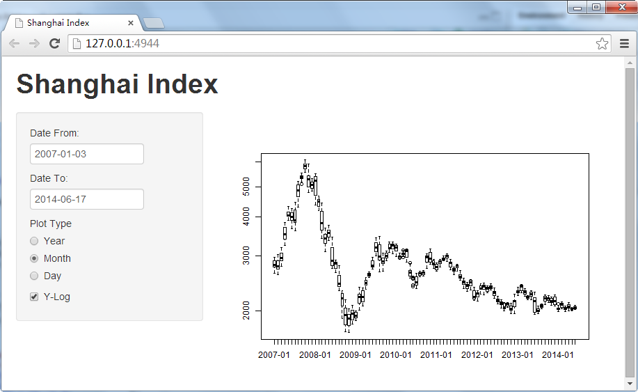

## Introduction

This app is built to plot Shanghai Index (SSEC)

**features**

1. Choosing time range 
2. Choosing plot type
3. Y-Axis can be 'Normal' or 'Log'  

---  



---


## Code
```{r message=FALSE, results='hide',warning=FALSE}
library(quantmod)
library(quantmod)
getSymbols('^SSEC')
DT <- data.frame(tm = time(SSEC),Close=as.numeric(SSEC$SSEC.Close))
DT$year <- format(DT$tm,"%Y")
DT$ym <- format(DT$tm,"%Y-%m")

```

---
## Line Plot
```{r }
plot(Close~tm,data = DT,type="l",pch=19,log="y")
```

---
## Box Plot 
```{r }
boxplot(Close~year,data = DT,log="y")
```


